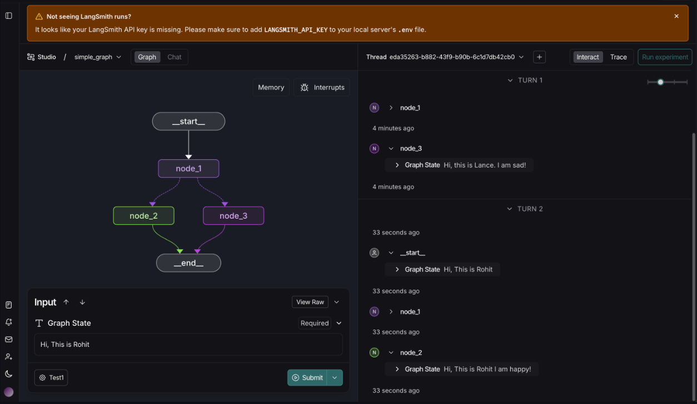
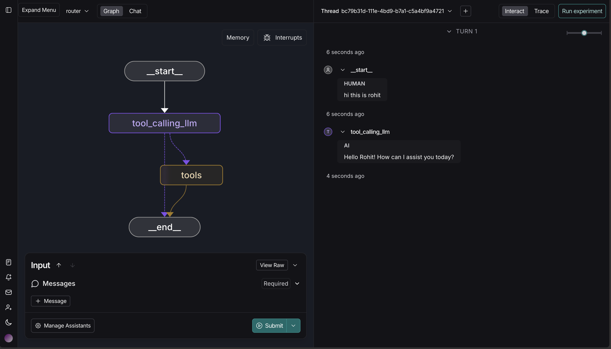
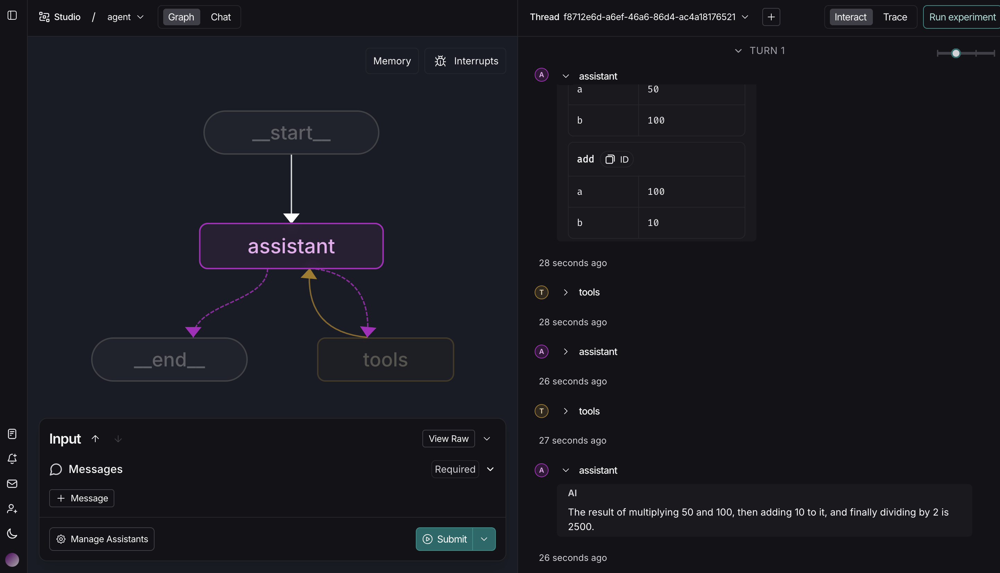

# Module 1

## Video 1 - Motivation:

We learned that LangGraph lets us combine the reliability of fixed control flows (chains) with flexibility of agents. It enables building structured customizable and partially autonomous AI systems. (There is no code for this video)

## Video 2 - Simple Graph

We learnt abot graph state, and created a function to track textual difference and timestamp each time a node updates.

What's changed: Added user_name, mood, previous_graph_state, diff, and last_updated into node outputs and the State type. Implemented a minimal graph runner so graph.invoke works, and replaced duplicate cells with a single biased decide mood.

## Video 3 - Langgraph Studio

We learnt how to use the langgraph studio UI in the browser and visualise the node in the UI by entering the graph state here itself.

What's changed: Played around with creating new assistant, looked at recursion limit when creating assistant.

## Video 4 - Chain

Learnt using messages as a state which lets us use chat models and tools interact in a structured, appadable conversation (MessageState + add_messages), Also learnt binding tools to a chat model enables the model to request and execute structured tool calls and then include tool's output back into the message stream.

What's changed: Inserted pretty_print_with_flavour() which basically attempts the original pretty_print() then adds a friendly comment. Also replaced the raw loop to print to output more structured outputs.

## Video 5 - Router

Learnt how graph can route b/w direct LLM response and tool execution by inspecting model output and using conditional edges, also learnt using a ToolNode and the tools_condition enables the model to request structured tool calls which are executed and inserted back into message stream.

What's changed: Added a post processed print output with emoji, and worked aroudn with langgraph ui better.

## Video 6 - Agent

Learnt how a ReAct style loop lets the mdoel call toold, observe tool outputs, and reason further by feeding tool response back intp the assistant node, also learnt on using MessageState with tool binding, also learnt on how to inspect the output of this in langsmith.

What's changed: Added a new tool to exponentiate a to b. Added a minimal helper that prints unified diffs between consecutive message/tool outputs and prints messages. this helps me inspect how the assistant's output changes after each tool call.

## Video 7 - Agent With Memory

Learnt how to add memory to the agent.

What's changed: Added more new tools(like sqrt, subtract, power, mod) and bound them to the LLM, and also tested langgraph ui for agents with multiple examples.

# Module 2

## Video 1 - Simple Schema

Learnt about typed state schemas, TypedDict, dataclass, Pydantic, which lets every node share a consistent contact so LangGraph graphs stay predictable.

What's Changed: Changed the mood to status channel with new "focused" or "relaxed" values.

## Video 2 - Simple Reducers

Learnt that reducers let parallel nodes safely merge updates so the state contract stays deterministic and also that annotated keys can swap between overwrite, append, or custom merge behaviors without rewriting nodes.

What changed: Replaced the foo channel with metric across the reducer examples for clearer intent.

## Video 4 - Trim Filter Messages

Learnt about message reducers, filters, and trimmers control how much of the conversation log reaches the model each turn, also learnt about maintaining a consistent message channel lets us reshape the chat thread without breaking LangGraph structure.

What's Changed: Relaced working list names with conversation_log and chat_thread so the code is more readable and also updated every invocation of these in the code.

## Video 5 - Chatbot with Summarizing Messages and History

Learnt about how a running outline lets the chatbot compress conversation history while LangGraph handles persistence across steps and threads, also learnt about conditional edge, which decide when to refresh the outline so the model receives structured context without reprocessing every message.

Whats changes: Renamed the state key to running_outline and rewrote the prompts to reflect the new terminology, also updated outline retrieval and state checks so the later cells which reference the new key when inspecting saved memory.
